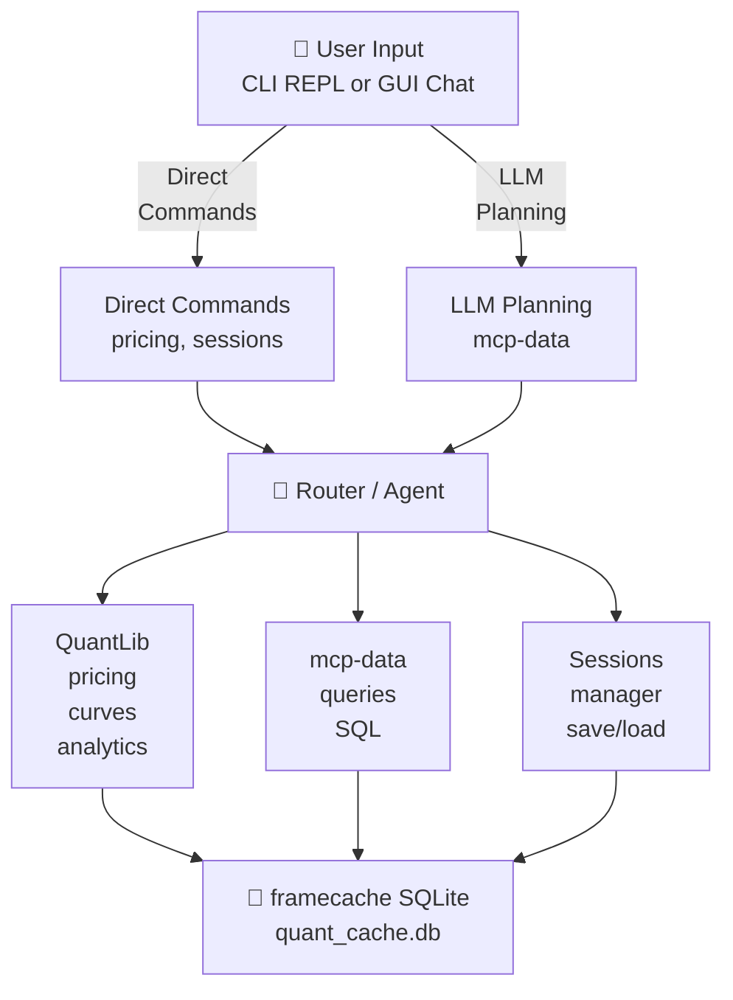

# CLAUDE.md

This file provides guidance to Claude Code (claude.ai/code) when working with code in this repository.

## Overview

cqfi is an interactive agent for QuantLib-based fixed-income analytics on government bonds. It combines:
- QuantLib for yield-curve modeling and CMT (Constant Maturity Treasury) pricing
- framecache (local SQLite) for caching analytics results
- mcp-data for natural-language SQL queries against SQLite/duckdb databases
- LLM integration (Claude) for intelligent query planning and result explanation
- GUI (pyside6) with Markdown rendering, sortable tables, and plotnine charts

The agent exposes both a **CLI REPL** (`cqfi`) and **GUI chat** (`cqfi-gui`) for the same underlying analytics engine.

## Architecture



**Key paths handled by `src/cqfi/`:**
- **`config.py`** — Load and validate YAML configs; resolve paths from environment or config files
- **`agent/`** — CLI REPL entry point (`cli.py`), query routing and planning logic (`planner.py`)
- **`quantlib/`** — Curve construction, CMT pricing, analytics, market context
- **`data/`** — Load zero/par rates from ycs_data.duckdb or ycs_data.sqlite or 
- **`cache/`** — framecache integration, session save/load, flattened SQL tables for LLM queries
- **`gui/`** — PySide6 GUI entry point, chat dialog, result rendering

## Common Development Tasks

### Setup
```powershell
cd D:\Code\cqfi
uv sync
copy .env.example .env  # optional — only needed for LLM mode
```

### Run CLI
```powershell
uv run cqfi
uv run cqfi --llm                # force LLM mode
uv run cqfi --rule               # force rule-based syntax
uv run main.py                   # IDE-friendly; auto-relaunches with .venv
```

### Run GUI
```powershell
uv run cqfi-gui
uv run cqfi-gui --config config/cqfi.yaml
```

### Run Tests
```powershell
uv run pytest                                      # run all tests
uv run pytest tests/test_cmt.py                   # single test file
uv run pytest tests/test_cmt.py::test_route_input_explicit  # single test
uv run pytest -v                                  # verbose output
```

### Debug in Cursor / VS Code
Launch profiles in `.vscode/launch.json`:
- `cqfi` — CLI interactive REPL
- `cqfi: one-shot query` — CLI with a preset query (edit in `launch.json`)
- `cqfi: price CMT` — CLI pricing smoke-run (`USA 2020-01-02`)
- `cqfi-gui` — GUI window
- `cqfi-gui: custom config` — GUI with explicit config file

## Key Modules and Responsibilities

### Configuration (`config.py`)
- **`AppSettings`** — Frozen dataclass holding resolved runtime paths
- **`load_settings(config_path)`** — Load YAML config and create `AppSettings`
- **`get_settings()`** — Get active settings (lazy-load default if not set)
- Paths: `ycs_db_path`, `ycs_semantics_dir`, `quant_cache_db_path`, `quant_cache_semantics_dir`, `sessions_dir`
- LangSmith tracing is off by default; set `CQFI_LANGSMITH=1` to enable

### CLI Agent (`agent/cli.py`, `agent/planner.py`)
- **`DatasetTarget`** enum — Routes queries to INPUT or CACHE
- **`route_query()`** — Infer target dataset from query text or explicit prefix (`input:` / `cache:`)
- **`CQFIRulePlanner`** — Extended rule-based planner for dataset introspection (`tables`, `schema TABLE`, `describe`)
- **Direct commands** — `price cmt <issuer> <date>`, `save`, `load`, `reset cache`, `sessions`
- **Query modes** — LLM (agent, single-shot) vs. rule-based syntax (offline)

### QuantLib Pricing (`quantlib/`)
- **`curve.py`** — `ZeroInterp` enum (18 methods), `build_zero_curve()`, curve fitting and interpolation
- **`cmt.py`** — `price_cmts_from_rates()`, CMT (Constant Maturity Treasury) pricing
- **`analytics.py`** — Bond analytics (duration, convexity, yield metrics)
- **`analytics_calculator.py`** — Batch calculation of bond analytics
- **`market_context.py`** — Market context and macro indicators
- **`issuers.py`** — 19 sovereign issuers with QuantLib conventions (day-count, calendar, coupon frequency)

### Data Loading (`data/rates_loader.py`)
- Load zero or par rates from ycs_data.db
- Return as polars DataFrame
- Follows QuantLib conventions per issuer

### Cache Management (`cache/`)
- **`manager.py`** — Integrates framecache SQLiteBackend, session save/load
- **`registry.py`** — Flattens cache outputs into SQL tables for LLM queries (`cmt_prices`, `calculation_log`)

### GUI (`gui/`)
- **`app.py`** — Main PySide6 entry point
- **`chat_dialog.py`** — ChatDialog widget (LLM conversation + result display)
- **`table_and_plot_widget.py`** — Renders result tables and charts
- **`plotnine_wrapper.py`** — Wraps plotnine for GUI embedding
- **`plot_settings_dialog.py`** — User-editable plot settings (facets, aesthetics)

## Configuration Files

### YAML Config (`config/cqfi.yaml`)
Shared by CLI and GUI. Defines paths and settings:
```yaml
paths:
  ycs_db: D:/data/duckdb/ycs_data.duckdb
  ycs_semantics: ./semantics/ycs_data.yaml
  bond_analytics_db: D:/data/duckdb/bond_analytics.duckdb
  quant_cache_db: ./data/cache/active_cache.db
  quant_cache_semantics: ./semantics
  sessions_dir: ./data/sessions
```
- **ycs_db** — read-only DuckDB or SQLite database with yield curves (zero rates and par rates) and spot FX rates
- **ycs_semantics** — YAML profile describing ycs_data schema for mcp-data
- **bond_analytics_db** — DuckDB or SQLite for bond analytics (historical analytics DB)
- **quant_cache_db** — writable SQLite where framecache stores results
- **quant_cache_semantics** — YAML profiles for cache tables

### Environment Variables
- **`ANTHROPIC_API_KEY`** — Claude API key; enables LLM mode
- **`CQFI_CONFIG`** — override default config path
- **`CQFI_YCS_DB`, `CQFI_YCS_SEMANTICS`, `CQFI_BOND_ANALYTICS_DB`, `CQFI_QUANT_CACHE_DB`, etc.** — optional per-path overrides in `.env`
- **`CQFI_RUNTIME_CONFIG`** — override path to runtime JSON (`~/.cqfi/cqfi_runtime.json`)
- **`CQFI_LANGSMITH`** — set to `1` to enable LangSmith tracing (normally off to avoid 403 noise)

### `.env` File
Secrets and optional machine-specific overrides. Copy from `.env.example`.
Path overrides take precedence over `config/cqfi.yaml` when set.
```
ANTHROPIC_API_KEY=sk-ant-...
```
Loaded by `config.py` via `python-dotenv`; does not override existing shell env.

## Dependencies and Integrations

### Local Packages (editable via `pyproject.toml`)
- **framecache** (`../framecache`) — SQLite-backed result caching with TTL
- **mcp-data** (`../mcp_data`) — Natural-language SQL planning and query execution

### Key PyPI Dependencies
- QuantLib — bond pricing, curve construction
- polars — data manipulation (preferred over pandas)
- pyside6 — GUI framework
- plotnine — ggplot2-style plotting
- pyyaml — config file parsing
- duckdb — alternative to SQLite for queries
- python-dotenv — load `.env` files

## Testing Notes

Tests live in `tests/` and use pytest:
- `test_config.py` — YAML loading, path resolution
- `test_planner.py` — Rule-based and LLM planners
- `test_cmt.py` — Query routing, pricing, issuer conventions
- `test_curve.py` — Curve construction and interpolation methods

Tests require the configured input database to exist at the path in `config/cqfi.yaml`; fall back to mocking or fixtures if unavailable.

## Important Design Patterns

### Query Routing
Queries are auto-routed to INPUT (yield curves) or CACHE (pricing results) based on keyword heuristics:
- `"zero rate"`, `"curve"`, `"yield"` → INPUT
- `"CMT"`, `"price"`, `"PV"` → CACHE
- Explicit prefixes override inference: `input:` or `cache:`

### Session Persistence
- `save [id]` pickles the active cache to `sessions_dir/{id}`
- `load id` restores cache from disk
- Useful for comparing runs or multi-step analyses

### Rule-Based vs. LLM Query Planning
- **Rule mode** (offline): parse `tables`, `schema TABLE`, `sql: SELECT …`
- **LLM mode** (with API key): natural-language questions are sent to Claude, which plans SQL queries
- **Single-shot** vs. **agent**: agent mode iterates on errors; single-shot is fire-and-forget

## Debugging Tips

- **Config not loading?** Check `CQFI_CONFIG`, default is `config/cqfi.yaml`
- **Missing ycs_data database?** Set `CQFI_YCS_DB` or update `config/cqfi.yaml`
- **LangSmith 403 errors?** Set `CQFI_LANGSMITH=0` or don't set `LANGCHAIN_TRACING_V2=true` globally
- **GUI not rendering?** Check PySide6 installation; may require a graphics environment
- **QuantLib import fails?** Ensure QuantLib package is installed; on Windows, may need pre-built wheels

## Workflow Tips

- Use `load`/`save` sessions to compare different curve interpolations or pricer assumptions
- The cache (`quant_cache.db`) is queryable — use `cache:` queries to review past runs
- Rule-based syntax works offline; LLM mode is only needed for natural-language dataset questions
- Curve methods default to `LINEAR_ZERO` (zero rates) or `LINEAR_ZERO` (par rates); use `interpolation=` to override
- Market context and macro indicators are available in the analytics output; use these for relative-value analysis
