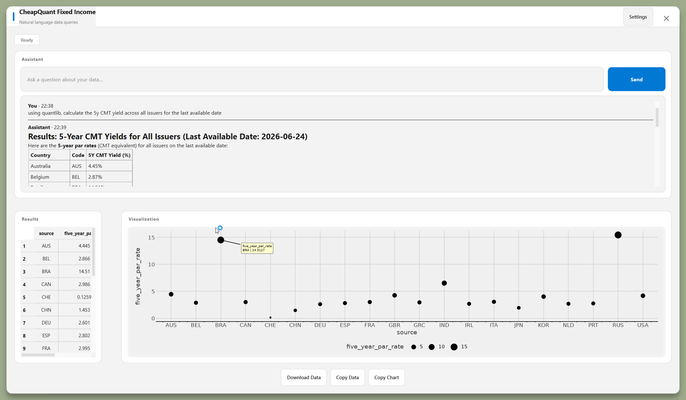

# cheapquant-fixed-income

Interactive agent for **QuantLib** fixed-income analytics on government bonds.
Yield-curve inputs come from a read-only SQLite or DuckDB database; QuantLib outputs are
cached in SQLite via [framecache](https://github.com/hraoyama/FrameCache) and
queryable through an LLM using [mcp-data](https://github.com/hraoyama/mcp_data).

Available as both a **terminal CLI** (`cqfi`) and a **GUI chat window** (`cqfi-gui`).

## Features

CheapQuant FI is built around **natural language**: you describe what you want,
the agent chooses tools and data sources, returns structured feedback, and (in
the GUI) renders tables and charts from the result.



### What you can drive by conversation

- **QuantLib** — price CMTs, bootstrap curves, and run fixed-income analytics
  (19 sovereign issuers, 18 curve interpolation/fitting methods). Ask in plain
  language; the agent invokes the QuantLib layer and explains what it computed.
  More features in dev.

- **Analytics cache** — every tool and pricing call is stored in a
  [framecache](https://github.com/hraoyama/FrameCache) SQLite cache. Query it
  with `cache:` prompts to review past runs, compare sessions, or pick up where
  you left off without recomputing.

- **Your databases (SQLite / DuckDB)** — attach read-only user datasets (yield
  inputs, bond universes, custom tables) described by YAML semantics. The agent
  plans SQL, runs it through [mcp-data](https://github.com/hraoyama/mcp_data),
  and surfaces the answer as text, a table, or a plot.

- **Mix and match** — combine sources in one flow: pull a curve from
  `ycs_data`, price a CMT with QuantLib, write results to the cache, then ask
  “plot the 5Y CMTs we just stored for Germany” — data and tools are composable,
  not siloed.

### On the roadmap *(in development)*

- **Plug-in user tools** — register your own Python callables as agent tools
  alongside the built-in QuantLib and SQL paths.

- **Historical analytics database** — persist bond/CMT analytics over time
  (`bond_analytics` DuckDB/SQLite) for longitudinal queries and reporting. Or plug in your own database for this.

### Interfaces

- **`cqfi` (CLI)** — interactive REPL with `input:` / `cache:` prefixes and
  direct commands (`price cmt …`, session save/load).

- **`cqfi-gui` (GUI)** — PySide6 chat window: Markdown replies, sortable result
  tables, auto-generated plotnine charts (see screenshot above), Download/Copy
  actions, and plot/table settings.

## Setup

```powershell
cd D:\Code\cheapquant-fixed-income
uv sync
copy .env.example .env   # optional — set ANTHROPIC_API_KEY for LLM mode
```

Paths are configured in `config/cqfi.yaml`, shared by both `cqfi` and
`cqfi-gui`. Override with `--config` or the `CQFI_CONFIG` environment variable.
Optional per-path overrides live in `.env` (see `.env.example`).

| Setting | Config key | Default |
|---------|------------|---------|
| YCS DB | `paths.ycs_db` | `D:/data/duckdb/ycs_data.duckdb` |
| YCS semantics | `paths.ycs_semantics` | `./semantics/ycs_data.yaml` |
| Bond analytics DB | `paths.bond_analytics_db` | `D:/data/duckdb/bond_analytics.duckdb` |
| Active cache | `paths.cache_db` | `./data/cache/active_cache.db` |
| Sessions | `paths.sessions_dir` | `./data/sessions/` |
| Cache semantics | `paths.cache_semantics_dir` | `./semantics` |
| Write analytics to bond DB | `settings.write_to_bond_analytics_db` | `true` |

## CLI usage (`cqfi`)

```powershell
uv run cqfi
uv run cqfi --config config/cqfi.yaml
uv run main.py        # IDE-friendly: auto-relaunches via .venv
```

```
cqfi> price cmt USA 2020-01-02
cqfi> price cmt DEU 2019-06-14 --par
cqfi> input: average 10Y zero rate for Germany in 2012
cqfi> cache: what 10Y CMT prices did we compute for USA?
cqfi> save my-run-001
cqfi> load my-run-001
```

### LLM mode

Natural-language dataset questions require LLM mode:

```powershell
# Option 1: set API key in .env — cqfi auto-enables single-shot LLM
ANTHROPIC_API_KEY=sk-ant-...

# Option 2: explicit flags
uv run cqfi --llm
uv run cqfi --llm-single-shot
```

Without an API key, use rule syntax (works offline):

```
input: tables
input: schema zero_rates
input: sql: SELECT AVG(Y010p0) FROM zero_rates WHERE source='DEU'
```

LangSmith tracing is **off by default** — set `CQFI_LANGSMITH=1` in `.env` to
opt in (requires `LANGCHAIN_API_KEY`).

## GUI usage (`cqfi-gui`)

```powershell
uv run cqfi-gui
uv run cqfi-gui --config config/cqfi.yaml
```

`cqfi-gui` uses the same `config/cqfi.yaml` as the CLI by default.
Set `ANTHROPIC_API_KEY` in `.env` to enable LLM-powered queries.

## Curve interpolation methods

Pass `interpolation=ZeroInterp.<METHOD>` to `build_zero_curve` / `price_cmts_from_rates`.

| Family | Members | Rate type |
|--------|---------|-----------|
| `InterpolatedZeroCurve` | `LINEAR_ZERO`, `CUBIC_ZERO`\*, `NATURAL_CUBIC_ZERO`, `MONOTONE_CUBIC_ZERO` | ZERO |
| `PiecewiseYieldCurve` | `LINEAR_ZERO`\*\*, `CUBIC_ZERO`, `NATURAL_CUBIC_ZERO`, `KRUGER_ZERO`, `CONVEX_MONOTONE_ZERO`, `LOG_LINEAR_DISCOUNT`, `LOG_CUBIC_DISCOUNT`, `NATURAL_LOG_CUBIC_DISCOUNT`, `KRUGER_LOG_DISCOUNT`, `SPLINE_CUBIC_DISCOUNT`, `LINEAR_FORWARD`, `FLAT_FORWARD` | PAR |
| `FittedBondDiscountCurve` | `NELSON_SIEGEL`, `SVENSSON`, `EXPONENTIAL_SPLINES`, `SIMPLE_POLYNOMIAL`, `CUBIC_BSPLINES` | PAR |

\* default for ZERO rate inputs · \*\* default for PAR rate inputs

## Architecture

```
ycs_data.duckdb/sqlite (read-only)          QuantLib (e.g. CMT pricing)
        │                                    │
        │                                    ▼
        │                          framecache SQLiteBackend
        │                                    │
        └──────── mcp-data agent ────────────┤
                 (input: / cache:)           │
                                             ▼
                                    cmt_prices / calculation_log
                                    (LLM-queryable tables)
                                             │
                        ┌────────────────────┴────────────────────┐
                        ▼                                         ▼
                   cqfi (CLI)                             cqfi-gui (GUI)
                  terminal REPL                      PySide6 ChatDialog window
```

## Project layout

```
src/cheapquant_fi/
  config.py              — YAML path configuration
  issuers.py             — sovereign conventions (19 issuers)
  tenors.py              — pillar column mapping
  data/rates_loader.py   — read zero/par rates from ycs_data.db
  quantlib/curve.py      — yield curve construction (ZeroInterp enum)
  quantlib/cmt.py        — CMT pricing
  cache/manager.py       — framecache + session save/load
  cache/registry.py      — flattened SQL tables for LLM queries
  agent/cli.py           — CLI REPL entry point (cqfi)
  gui/app.py             — GUI entry point (cqfi-gui)
  gui/chat_dialog.py     — ChatDialog window (chat + table + plot)
config/cqfi.yaml           — path and settings configuration (CLI + GUI)
semantics/quant_cache.yaml — semantic profile for cached results
.vscode/launch.json        — Cursor/VS Code debug configurations
```

## Debug configurations (Cursor / VS Code)

Five launch profiles are defined in `.vscode/launch.json`:

| Name | What it runs |
|------|-------------|
| `cqfi` | CLI interactive REPL |
| `cqfi: one-shot query` | CLI with a single query argument (edit in `launch.json`) |
| `cqfi: price CMT` | CLI pricing smoke-run (`USA 2020-01-02`) |
| `cqfi-gui` | GUI window (uses `config/cqfi.yaml`) |
| `cqfi-gui: custom config` | GUI window with explicit `--config` flag |

## Dependencies

Local editable packages (via `pyproject.toml` `[tool.uv.sources]`):

- `uv add git+https://github.com/FulgentMcGuffin/framecache.git`
- `uv add git+https://github.com/FulgentMcGuffin/mcp_data.git`

PyPI: `QuantLib`, `polars`, `pyside6`, `plotnine`, `pyyaml`, `python-dotenv`
