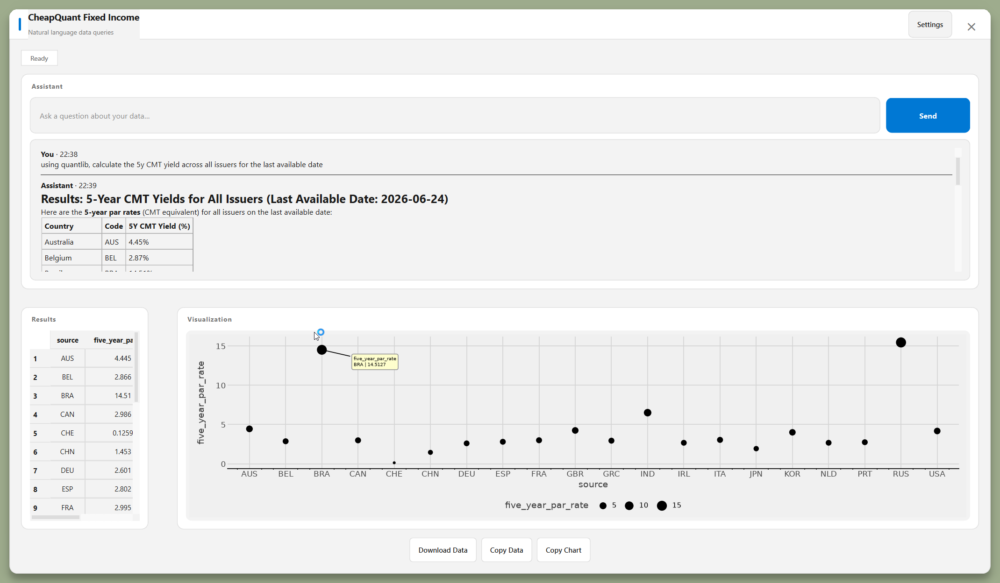
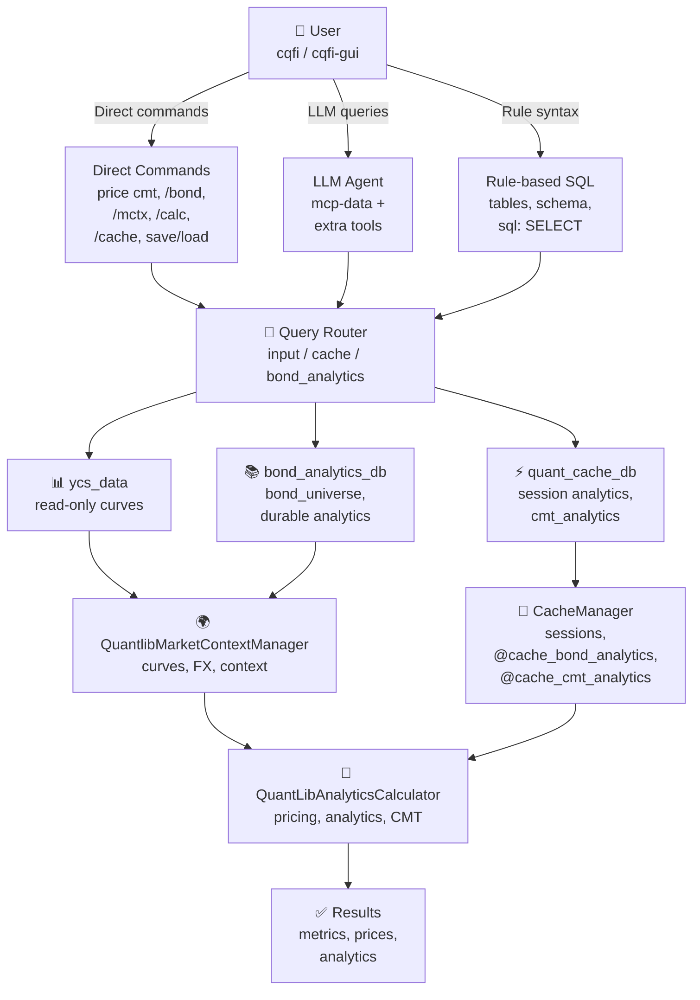

# cheapquant-fixed-income

Interactive agent for **QuantLib** fixed-income analytics on government bonds.
Yield-curve inputs come from a read-only DuckDB or SQLite database (`ycs_data`);
session analytics are written to a separate **quant cache** database (`quant_cache_db`);
bond universes and durable analytics live in **bond analytics** (`bond_analytics_db`);
and all three datasets are queryable through an LLM using [mcp-data](https://github.com/hraoyama/mcp_data).

Available as both a **terminal CLI** (`cqfi`) and a **GUI chat window** (`cqfi-gui`).

## Features

CheapQuant FI is built around **natural language**: you describe what you want,
the agent chooses tools and data sources, returns structured feedback, and (in
the GUI) renders tables and charts from the result.



### What you can do today

- **QuantLib pricing & analytics** — bootstrap yield curves (19 sovereign issuers,
  18 interpolation/fitting methods), price CMTs, and compute bond/CMT analytics:
  yield, duration, convexity, z-spread, par yield, curve zero rate, carry, and
  yield rolls (spot and forward at 1m/3m/6m/1y horizons). Bond analytics also
  return maturity-matched par-yield and fixed-coupon CMT comparables.

- **Market context** — lazy-built `QuantlibMarketContext` objects keyed by
  valuation date and issuer. Curves are loaded from `ycs_data` on demand and
  cached in a process-wide singleton. Use `/mctx` in the CLI or GUI, or the
  `check_market_context` LLM tool, to verify/build curves.

- **Bond lookup** — look up individual bonds from `bond_universe` by
  `user_friendly_id` or `bond_id` via `/bond`, `@mention` syntax, or the
  `get_bond` LLM tool. Bonds deserialize into typed `Bond` objects via
  `BondManager`.

- **Bond analytics** — compute fixed-income metrics using `/calc <bond_id> …` or the
  `compute_bond_analytics` LLM tool. Trade date and curve label are optional
  (default to latest date and `BOND_ZERO`).

- **CMT analytics** — compute forward-starting constant-maturity treasury (CMT)
  analytics using `/calc <issuer> <composite_tenor> [trade_date]` or the
  `compute_cmt_analytics` LLM tool. The composite tenor combines a forward start
  and forward end (e.g. `5y`, `10y2y`, `18m4w9m4d`). Trade date defaults to the
  latest `zero_rates` date for that issuer. The CMT is priced at par on the curve
  (unadjusted coupon schedule, like other CMTs).

- **Three queryable datasets** (auto-routed by keyword, or forced with a prefix):

  | Prefix | Database | Typical questions |
  |--------|----------|-----------------|
  | `input:` | `ycs_db` | zero/par rates, FX, correlations, curve slopes |
  | `cache:` | `quant_cache_db` | session bond/CMT analytics, calculation log |
  | `bond_analytics:` | `bond_analytics_db` | bond universe, stored analytics, CMT analytics |

- **Session quant cache** — when enabled, `/calc` (bond or CMT) and the
  `compute_bond_analytics` / `compute_cmt_analytics` tools persist rows to
  `quant_cache_db` (`bond_analytics`, `cmt_analytics`). Toggle at runtime with
  `/cache on|off`. On application exit, `/save_cache` controls whether those rows
  merge into `bond_analytics_db` or are discarded.

- **Named cache sessions** — save/load full `quant_cache_db` snapshots under
  `sessions_dir` to compare runs (`save`, `load`, `sessions`, `reset cache`).

- **Mix and match** — pull a curve from `ycs_data`, ensure market context exists,
  compute bond analytics, optionally cache results, then query them with
  `cache:` or `bond_analytics:` prefixes.

### On the roadmap

- **Plug-in user tools** — register custom Python callables as agent tools
  alongside the built-in QuantLib and SQL paths.

### Interfaces

- **`cqfi` (CLI)** — interactive REPL with dataset prefixes, slash commands,
  direct pricing, session save/load, and runtime cache toggles.

- **`cqfi-gui` (GUI)** — PySide6 chat window with the same routing and slash
  commands as the CLI: Markdown replies, sortable tables, plotnine charts,
  Download/Copy actions, and plot/table settings.

## Setup

```powershell
cd D:\Code\cheapquant-fixed-income
uv sync
copy .env.example .env   # optional — set ANTHROPIC_API_KEY for LLM mode
```

Paths are configured in `config/cqfi.yaml`, shared by both `cqfi` and
`cqfi-gui`. Override with `--config` or the `CQFI_CONFIG` environment variable.
Optional per-path overrides live in `.env` (see `.env.example`).

On startup, `ycs_db`, `bond_analytics_db`, and `quant_cache_db` must resolve to
**distinct** paths; the same applies to the three semantics profiles.

| Setting | Config key | Default |
|---------|------------|---------|
| YCS DB | `paths.ycs_db` | `D:/data/duckdb/ycs_data.duckdb` |
| YCS semantics | `paths.ycs_semantics` | `./semantics/ycs_data.yaml` |
| Bond analytics DB | `paths.bond_analytics_db` | `D:/data/duckdb/bond_analytics.duckdb` |
| Bond analytics semantics | `paths.bond_analytics_semantics` | `./semantics/bond_analytics.yaml` |
| Quant cache DB | `paths.quant_cache_db` | `D:/data/duckdb/quant_cache.duckdb` |
| Quant cache semantics | `paths.quant_cache_semantics` | `./semantics/quant_cache.yaml` |
| Sessions | `paths.sessions_dir` | `./data/sessions/` |

### Runtime settings

Mutable session behaviour is stored in `~/.cqfi/cqfi_runtime.json` (override
with `CQFI_RUNTIME_CONFIG`). Values load on startup and save on exit.

| Setting | Slash command | Effect |
|---------|---------------|--------|
| `use_quant_cache` | `/cache on\|off` | Write `/calc` and analytics-tool results to `quant_cache_db` during the session |
| `save_quant_cache_to_bond_analytics_after_session` | `/save_cache on\|off` | On exit: merge cache rows into `bond_analytics_db`, or delete cache rows only |

Build or refresh the bond analytics database (schema + CSV seed data):

```powershell
uv run python -m cheapquant_fi.data.create_bond_analytics_db
```

## CLI usage (`cqfi`)

```powershell
uv run cqfi
uv run cqfi --config config/cqfi.yaml
uv run main.py        # IDE-friendly: auto-relaunches via .venv
```

### Dataset queries

```
cqfi> input: average 10Y zero rate for Germany in 2012
cqfi> cache: show bond analytics computed this session
cqfi> bond_analytics: show bonds for France maturing after 2030
```

Prefixes are optional when the question clearly targets one dataset (e.g.
"zero rate" → `input:`, "cached analytics" → `cache:`, "bond universe" →
`bond_analytics:`).

### Direct commands

#### Pricing

```
cqfi> price cmt USA 2020-01-02
cqfi> price cmt DEU 2019-06-14 --par
```

CMT pricing reads `ycs_data` and returns a DataFrame; it does **not** write to
`quant_cache_db`.

#### Market context

```
cqfi> /mctx 2024-02-15              # Check all curves for the date
cqfi> /mctx 2024-02-15 USA          # Check USA market for the date
cqfi> /mctx 2024-02-15 USA BOND_ZERO
cqfi> /mctx                         # Show /mctx help
```

#### Bond lookup

```
cqfi> /bond usa10y001
cqfi> /bond fraapr029
cqfi> @fraapr029                    # bare @mention shorthand
cqfi> /bond                         # Show /bond help
```

#### Bond and CMT analytics

`/calc` supports two forms. Bond form:

```
cqfi> /calc fraapr029
cqfi> /calc usa10y001 2024-02-15
cqfi> /calc fraapr029 2024-02-15 BOND_PAR
```

CMT form — issuer plus composite tenor, optional trade date:

```
cqfi> /calc DEU 5y                      # 5Y CMT, latest zero_rates date for DEU
cqfi> /calc FRA 10y2y                   # forward 10y2y CMT for France
cqfi> /calc DEU 18m4w9m4d 2024-02-15    # explicit trade date
cqfi> /calc                             # Show /calc help (both forms)
```

| Argument | Bond form | CMT form |
|----------|-----------|----------|
| 1st | `bond_id` or `user_friendly_id` | Issuer code or alias (`DEU`, `FRA`, `usa`, …) |
| 2nd | Optional `YYYY-MM-DD` trade date | Composite tenor string (`5y`, `10y2y`, …) |
| 3rd | Optional curve label (`BOND_ZERO`, `BOND_PAR`) | Optional `YYYY-MM-DD` trade date |
| 4th | Optional JSON repo term structure | — |

When `/cache on` is active, bond runs write bond + linked maturity-matched CMT
rows to `quant_cache_db`; standalone CMT runs write one row to `cmt_analytics`
(`is_fixed_coupon = 0`).

#### Quant cache toggles

```
cqfi> /cache on                     # Enable session writes to quant_cache_db
cqfi> /cache off
cqfi> /cache                        # Help + current use_quant_cache value

cqfi> /save_cache on                # Merge cache into bond_analytics_db on exit
cqfi> /save_cache off               # Discard cache analytics on exit (no merge)
cqfi> /save_cache                   # Help + current save setting
```

#### Session management

```
cqfi> save my-run-001               # Copy quant_cache_db to sessions/
cqfi> load my-run-001
cqfi> sessions
cqfi> reset cache                   # Clear quant cache DB and analytics tables
```

### LLM mode

Natural-language dataset questions require LLM mode:

```powershell
# Option 1: set API key in .env — cqfi auto-enables single-shot LLM
ANTHROPIC_API_KEY=sk-ant-...

# Option 2: explicit flags
uv run cqfi --llm
uv run cqfi --llm-single-shot
```

In LLM mode the agent can call SQL tools **and** fixed-income tools:

- `get_bond` — look up a bond and return its JSON representation
- `check_market_context` — ensure curves exist for a valuation date/issuer
- `compute_bond_analytics` — calculate bond analytics (yield, duration, convexity, carry, etc.)
- `compute_cmt_analytics` — calculate CMT analytics for an issuer and composite tenor

Example prompts:

```
Is there a market for France on 2022-02-17?
Show bond usa10y001 as JSON
Calculate analytics for fraapr029
Compute CMT analytics for DEU 5y on 2024-02-15
What is the duration of USA 10Y on 2024-02-15?
```

Without an API key, use rule syntax (works offline):

```
input: tables
input: schema zero_rates
input: sql: SELECT AVG(Y010p0) FROM zero_rates WHERE source='DEU'
bond_analytics: schema bond_universe
```

Force rule syntax even when an API key is set: `cqfi --rule`

LangSmith tracing is **off by default** — set `CQFI_LANGSMITH=1` in `.env` to
opt in (requires `LANGCHAIN_API_KEY`).

## GUI usage (`cqfi-gui`)

```powershell
uv run cqfi-gui
uv run cqfi-gui --config config/cqfi.yaml
```

The GUI uses the same `config/cqfi.yaml`, runtime JSON settings, dataset routing,
and slash commands (`/bond`, `/mctx`, `/calc` for bond or CMT analytics,
`/cache`, `/save_cache`) as the CLI. Set `ANTHROPIC_API_KEY` in `.env` for
LLM-powered queries.

## Bond analytics (Python API)

The analytics layer is split into typed inputs/outputs and a QuantLib backend.

```python
from datetime import date

from cheapquant_fi.analytics_input import BondAnalyticsInput
from cheapquant_fi.bond_manager import BondManager
from cheapquant_fi.numeric_term_structure import NumericTermStructure
from cheapquant_fi.quantlib.quantlib_analytics_calculator import QuantLibAnalyticsCalculator
from cheapquant_fi.quantlib.quantlib_market_context_manager import QuantlibMarketContextManager

market = QuantlibMarketContextManager.instance().get(date(2024, 1, 15), "DEU")

bond = BondManager.instance().get("usa10y001")
request = BondAnalyticsInput.from_bond(
    bond,
    trade_date=date(2024, 1, 15),
    repo_term_structure=NumericTermStructure(
        {"1m": 5.25, "3m": 5.10, "6m": 4.95, "1y": 4.80},
        as_of=date(2024, 1, 15),
    ),
)

calc = QuantLibAnalyticsCalculator()
bond_metrics, mm_cmt, mm_fc_cmt = calc.compute_bond_analytics(request, market)

print(bond_metrics.yield_to_maturity)
print(bond_metrics.z_spread)
print(mm_cmt.clean_price)         # maturity-matched par-yield CMT (~100)
print(mm_fc_cmt.clean_price)      # maturity-matched fixed-coupon CMT
print(bond_metrics.as_json())
```

When `use_quant_cache` is true (via `/cache on` or runtime JSON), the
`@cache_bond_analytics` decorator on `compute_bond_analytics` persists bond and
linked CMT rows to `quant_cache_db`; `@cache_cmt_analytics` on
`compute_cmt_analytics` persists standalone CMT rows to `cmt_analytics`.

| Field | Meaning |
|-------|---------|
| `yield_to_maturity`, `clean_price`, `dirty_price`, `accrued_interest` | Standard price/yield measures |
| `duration`, `convexity`, `dv01_sensitivity`, `gamma_sensitivity` | Risk metrics |
| `z_spread` | Z-spread to curve (bps) |
| `par_yield`, `zero_rate` | Par yield and curve zero at maturity (%) |
| `roll_*_spotyield`, `roll_*_fwdyield` | Roll-down metrics |
| `carry_*` | Yield minus repo rate from an optional `NumericTermStructure` |

### CMT analytics (Python API)

Forward-starting CMTs use `CmtAnalyticsInput` and `CompositeTenor`. The coupon
is the par yield that prices the CMT at 100 clean at forward settlement.

```python
from datetime import date

from cheapquant_fi.analytics_input import CmtAnalyticsInput
from cheapquant_fi.quantlib.quantlib_analytics_calculator import QuantLibAnalyticsCalculator
from cheapquant_fi.quantlib.quantlib_market_context_manager import QuantlibMarketContextManager

# From a combined tenor string (same parsing as /calc DEU 10y2y)
request = CmtAnalyticsInput.from_string("DEU", "10y2y", trade_date=date(2024, 1, 15))
market = QuantlibMarketContextManager.instance().get(date(2024, 1, 15), "DEU")

calc = QuantLibAnalyticsCalculator()
cmt_metrics = calc.compute_cmt_analytics(request, market)

print(cmt_metrics.clean_price)       # ~100 at par
print(cmt_metrics.yield_to_maturity)
print(cmt_metrics.par_yield)
```

CLI equivalent: `/calc DEU 10y2y 2024-01-15`

## Tenor strings

Human-readable tenors are parsed by the `Tenor` class (`tenor.py`). Forward-starting
**composite tenors** (used by `/calc <issuer> <composite_tenor>` and
`CmtAnalyticsInput`) combine a starting delay and a forward period via
`CompositeTenor` (`composite_tenor.py`):

```python
from datetime import date

from cheapquant_fi.composite_tenor import CompositeTenor
from cheapquant_fi.tenor import Tenor

t = Tenor.parse("12y4M3w12d")
t.simplify()
t.add_to(date(2024, 1, 15))
t.days_tenor(date(2024, 1, 31))

# Combined strings: immediate 5y, or 10y forward start + 2y forward (→ 12y total)
ct = CompositeTenor.from_combined_tenor("DEU", "10y2y")
str(ct)   # e.g. deu10y2y
```

`NumericTermStructure` maps tenor labels to numeric rates for carry calculations.

## Curve interpolation methods

Pass `interpolation=QLZeroInterp.<METHOD>` to `ql_build_zero_curve` /
`price_cmts_from_rates` (see `quantlib/quantlib_curve.py`).

| Family | Members | Rate type |
|--------|---------|-----------|
| `InterpolatedZeroCurve` | `LINEAR_ZERO`, `CUBIC_ZERO`\*, `NATURAL_CUBIC_ZERO`, `MONOTONE_CUBIC_ZERO` | ZERO |
| `PiecewiseYieldCurve` | `LINEAR_ZERO`\*\*, `CUBIC_ZERO`, `NATURAL_CUBIC_ZERO`, `KRUGER_ZERO`, `CONVEX_MONOTONE_ZERO`, `LOG_LINEAR_DISCOUNT`, … | PAR |
| `FittedBondDiscountCurve` | `NELSON_SIEGEL`, `SVENSSON`, `EXPONENTIAL_SPLINES`, `SIMPLE_POLYNOMIAL`, `CUBIC_BSPLINES` | PAR |

\* default for ZERO rate inputs · \*\* default for PAR rate inputs

## Architecture


```mermaid
flowchart TD
    User["👤 User<br/>cqfi / cqfi-gui"]
    
    User -->|Direct commands| DCmd["Direct Commands<br/>price cmt, /bond,<br/>/mctx, /calc,<br/>/cache, save/load"]
    User -->|LLM queries| LLM["LLM Agent<br/>mcp-data +<br/>extra tools"]
    User -->|Rule syntax| Rules["Rule-based SQL<br/>tables, schema,<br/>sql: SELECT"]
    
    DCmd --> Router["🔀 Query Router<br/>input / cache / bond_analytics"]
    LLM --> Router
    Rules --> Router
    
    Router --> YCS["📊 ycs_data<br/>read-only curves"]
    Router --> Bond["📚 bond_analytics_db<br/>bond_universe,<br/>durable analytics"]
    Router --> Cache["⚡ quant_cache_db<br/>session analytics,<br/>cmt_analytics"]
    
    YCS --> MktCtx["🌍 QuantlibMarketContextManager<br/>curves, FX, context"]
    Bond --> MktCtx
    Cache --> CacheMgr["💾 CacheManager<br/>sessions,<br/>@cache_bond_analytics,<br/>@cache_cmt_analytics"]
    
    MktCtx --> Calc["🧮 QuantLibAnalyticsCalculator<br/>pricing, analytics, CMT"]
    CacheMgr --> Calc
    
    Calc --> Result["✅ Results<br/>metrics, prices,<br/>analytics"]
```

**Configuration layers:**

| Layer | Location | Contents |
|-------|----------|----------|
| Static paths | `config/cqfi.yaml` + env overrides | DB paths, semantics YAML, sessions dir |
| Runtime toggles | `~/.cqfi/cqfi_runtime.json` | `use_quant_cache`, `save_quant_cache_to_bond_analytics_after_session` |

**Key design points:**

- **`AppSettings`** (`config.py`) resolves paths, validates that the three DB
  and three semantics paths are distinct, and registers MCP datasets with routing
  keywords.

- **`RuntimeSettings`** (`config.py`) holds mutable cache behaviour; slash
  commands update and persist it. **`finalize_quant_cache_session`** runs on
  application exit to merge or discard `quant_cache_db` analytics.

- **`QuantlibMarketContextManager`** lazily builds curves from `ycs_data`.

- **`QuantLibAnalyticsCalculator.compute_bond_analytics`** returns
  `(bond_metrics, mm_cmt_metrics, mm_fc_cmt_metrics)` and optionally persists
  via `@cache_bond_analytics` when `use_quant_cache` is enabled.

- **`QuantLibAnalyticsCalculator.compute_cmt_analytics`** prices a
  forward-starting CMT from a `CompositeTenor` and optionally persists via
  `@cache_cmt_analytics`.

- **`CacheRegistry`** materialises `bond_analytics` / `cmt_analytics` tables in
  `quant_cache_db` from `semantics/quant_cache.yaml`.

- **Semantics YAML** (`semantics/`) describes each database for mcp-data so the
  LLM can plan SQL without hard-coded schema knowledge.

Additional datasets can be registered in `cqfi.yaml` under a top-level
`datasets:` block — no code changes required.

## Project layout

```
src/cheapquant_fi/
  config.py                         — AppSettings, RuntimeSettings, path validation
  issuers.py                        — 19 sovereign IssuerProfile conventions
  instruments.py                    — Bond dataclass (from bond_universe rows)
  bond_manager.py                   — singleton bond lookup cache
  composite_tenor.py                — CompositeTenor (forward-start CMT tenors)
  tenor.py                          — Tenor parse/simplify/calendar math
  numeric_term_structure.py         — tenor → rate mappings (repo curves, etc.)
  analytics_input.py                — BondAnalyticsInput, CmtAnalyticsInput
  analytics_output.py               — FixedIncomeAnalyticsOutput
  analytics_calculator.py           — AnalyticsCalculator protocol
  cli_tools.py                      — get_bond, check_market_context, compute_bond_analytics, compute_cmt_analytics, /calc parsing
  agent/
    cli.py                          — cqfi REPL, slash commands, query routing
    planner.py                      — rule/LLM query planning
  quantlib/
    quantlib_curve.py               — curve construction (QLZeroInterp enum)
    quantlib_market_context.py      — curve collections, FX, context builder
    quantlib_market_context_manager.py
    quantlib_analytics_calculator.py
    cmt.py                          — CMT pricing (no cache write)
  data/
    rates_loader.py                 — read zero/par rates from ycs_data
    create_bond_analytics_db.py     — build/populate bond_analytics DB
  cache/
    manager.py                      — CacheManager, sessions, CMT pricing entry
    registry.py                     — bond_analytics / cmt_analytics in quant_cache_db
    decorators.py                   — @cache_bond_analytics, @cache_cmt_analytics
    session_finalize.py             — merge or discard cache on exit
  gui/
    app.py                          — cqfi-gui entry point
    chat_dialog.py                  — chat + result rendering (slash command parity)
config/cqfi.yaml                    — static path config
semantics/
  ycs_data.yaml
  bond_analytics.yaml
  quant_cache.yaml
```

## Debug configurations (Cursor / VS Code)

Five launch profiles are defined in `.vscode/launch.json`:

| Name | What it runs |
|------|-------------|
| `cqfi` | CLI interactive REPL |
| `cqfi: one-shot query` | CLI with a single query argument (edit in `launch.json`) |
| `cqfi: price CMT` | CLI pricing smoke-run (`USA 2020-01-02`) |
| `cqfi-gui` | GUI window (uses `config/cqfi.yaml`) |
| `cqfi-gui: custom config` | GUI window with explicit `--config` flag |

## Dependencies

Local editable packages (via `pyproject.toml` `[tool.uv.sources]`):

- [framecache](https://github.com/FulgentMcGuffin/framecache) — optional SQLite blob cache (when `quant_cache_db` is SQLite)
- [mcp-data](https://github.com/FulgentMcGuffin/mcp_data) — natural-language SQL planning
- [decorules](https://github.com/FulgentMcGuffin/decorules) — declarative validation decorators

PyPI: `QuantLib`, `polars`, `pyside6`, `plotnine`, `pyyaml`, `python-dotenv`,
`duckdb`, `anthropic`
