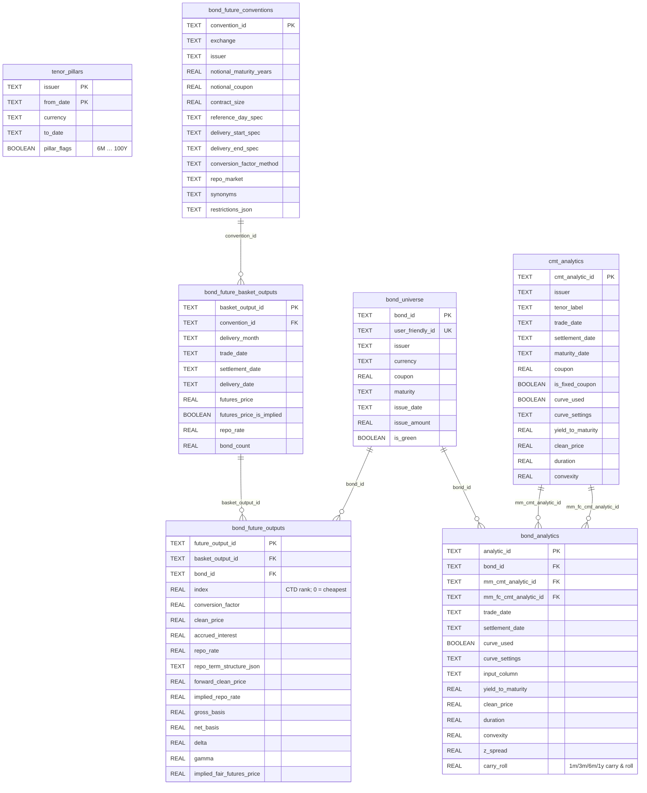
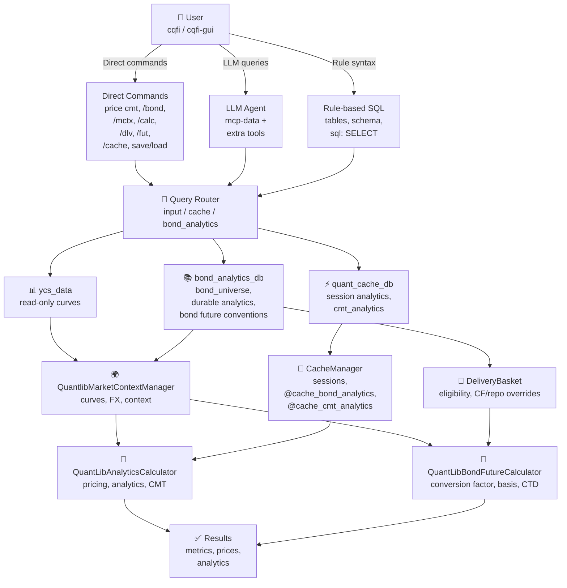

# cqfi (cheap quant fixed income)

⭐ If you find this repository useful, please **consider starring it**.

Interactive agent for **QuantLib** fixed-income analytics on government bonds.
and their exchange-traded futures.

Yield-curve inputs come from a read-only DuckDB or SQLite database (`ycs_data`);
session analytics are written to a separate **quant cache** database (`quant_cache_db`);
bond universes and durable analytics live in **bond analytics** (`bond_analytics_db`);
and all three datasets are queryable through an LLM using [mcp-data](https://github.com/hraoyama/mcp_data).

Available as both a **terminal CLI** (`cqfi`) and a **GUI chat window** (`cqfi-gui`).

## Features

cqfi is built around **natural language**: you describe what you want,
the agent chooses tools and data sources, returns structured feedback, and (in
the GUI) renders tables and charts from the result.


### What you can do today

- **QuantLib pricing & analytics** — bootstrap yield curves (19 sovereign issuers,
  18 interpolation/fitting methods), price CMTs, and compute bond/CMT analytics:
  yield, duration, convexity, z-spread, par yield, curve zero rate, carry, and
  yield rolls (spot and forward at 1m/3m/6m/1y horizons). Bond analytics also
  return maturity-matched par-yield and fixed-coupon CMT comparables. 

- **Market context** — lazy-built `QuantlibMarketContext` objects keyed by
  valuation date and issuer. Curves are loaded from `ycs_data` on demand and
  cached in a process-wide singleton. Use `/mctx` in the CLI or GUI, or the
  `check_market_context` LLM tool, to verify/build curves.

- **Bond lookup** — look up individual bonds from `bond_universe` by
  `user_friendly_id` or `bond_id` via `/bond`, `@mention` syntax, or the
  `get_bond` LLM tool. Bonds deserialize into typed `Bond` objects via
  `BondManager`.

- **Bond analytics** — compute fixed-income metrics using `/calc <bond_id> …` or the
  `compute_bond_analytics` LLM tool. Trade date and curve label are optional
  (default to latest date and `BOND_ZERO`).

- **CMT analytics** — compute forward-starting constant-maturity treasury (CMT)
  analytics using `/calc <issuer> <composite_tenor> [trade_date]` or the
  `compute_cmt_analytics` LLM tool. The composite tenor combines a forward start
  and forward end (e.g. `5y`, `10y2y`, `18m4w9m4d`). Trade date defaults to the
  latest `zero_rates` date for that issuer. The CMT is priced at par on the curve
  (unadjusted coupon schedule, like other CMTs).

- **Bond Future analytics** — a static registry of 30 exchange-traded government
  bond future contracts (CME, Eurex, ICE and the Osaka Exchange; 9 sovereign
  issuers) with exchange-specific conversion-factor formulas, delivery calendars,
  and basket eligibility rules (remaining maturity, original term, minimum issue
  size, green exclusion). Build a delivery basket — every eligible bond from
  `bond_universe`, or an explicit list with optional hard-coded conversion
  factors — with `/dlv <name> <future> [bonds...] [delivery]`, then compute
  conversion factor, implied repo rate, gross and net basis, delta, gamma and
  implied fair futures price (cheapest-to-deliver first) with `/fut
  <basket|contract> [trade_date] [repo]`, or the `build_delivery_basket` /
  `compute_bond_future_analytics` LLM tools. An optional repo argument — a flat
  rate held for eternity, or a full tenor curve — feeds the carry-to-delivery
  calculation for every bond in the basket; without one, each bond's own
  discount-curve forward rate is used instead. The Python API goes one step
  further and lets an individual deliverable bond carry its own repo term
  structure (`DeliveryBasket.add(..., repo_term_structure=...)` /
  `set_repo_term_structure`), overriding the basket-wide curve for that bond only.

- **Three queryable datasets** (auto-routed by keyword, or forced with a prefix):

  | Prefix | Database | Typical questions |
  |--------|----------|-----------------|
  | `input:` | `ycs_db` | zero/par rates, FX, correlations, curve slopes |
  | `cache:` | `quant_cache_db` | session bond/CMT analytics, calculation log |
  | `bond_analytics:` | `bond_analytics_db` | bond universe, stored bond/CMT analytics, bond future conventions and basis analytics |

- **Session quant cache** — when enabled, `/calc` (bond or CMT), `/fut`, and the
  `compute_bond_analytics`, `compute_cmt_analytics`, and
  `compute_bond_future_analytics` tools persist rows to `quant_cache_db`
  (`bond_analytics`, `cmt_analytics`, `bond_future_basket_outputs`,
  `bond_future_outputs`). Toggle at runtime with `/cache on|off`. On application
  exit, `/save_cache` controls whether those rows merge into `bond_analytics_db`
  (including `bond_future_conventions` upserts) or are discarded.

- **Named cache sessions** — save/load full `quant_cache_db` snapshots under
  `sessions_dir` to compare runs (`save`, `load`, `sessions`, `reset cache`).

- **Mix and match** — pull a curve from `ycs_data`, ensure market context exists,
  compute bond analytics, optionally cache results, then query them with
  `cache:` or `bond_analytics:` prefixes. Or build a delivery basket with `/dlv`,
  run `/fut` with a repo curve across several trade dates, and compare the
  cheapest-to-deliver bond and its net basis over time.

### On the roadmap

- **Plug-in user tools** — register custom Python callables as agent tools
  alongside the built-in QuantLib and SQL paths.

### Interfaces

- **`cqfi` (CLI)** — interactive REPL with dataset prefixes, slash commands,
  direct pricing, session save/load, and runtime cache toggles.

- **`cqfi-gui` (GUI)** — PySide6 chat window with the same routing and slash
  commands as the CLI: Markdown replies, sortable tables, plotnine charts,
  Download/Copy actions, and plot/table settings.

## Setup

```powershell
cd D:\Code\cqfi
uv sync
copy .env.example .env   # optional — set ANTHROPIC_API_KEY for LLM mode
```

Paths are configured in `config/cqfi.yaml`, shared by both `cqfi` and
`cqfi-gui`. Override with `--config` or the `CQFI_CONFIG` environment variable.
Optional per-path overrides live in `.env` (see `.env.example`).

On startup, `ycs_db`, `bond_analytics_db`, and `quant_cache_db` must resolve to
**distinct** paths; the same applies to the three semantics profiles.

| Setting | Config key | Default |
|---------|------------|---------|
| YCS DB | `paths.ycs_db` | `D:/data/duckdb/ycs_data.duckdb` |
| YCS semantics | `paths.ycs_semantics` | `./semantics/ycs_data.yaml` |
| Bond analytics DB | `paths.bond_analytics_db` | `D:/data/duckdb/bond_analytics.duckdb` |
| Bond analytics semantics | `paths.bond_analytics_semantics` | `./semantics/bond_analytics.yaml` |
| Quant cache DB | `paths.quant_cache_db` | `D:/data/duckdb/quant_cache.duckdb` |
| Quant cache semantics | `paths.quant_cache_semantics` | `./semantics/quant_cache.yaml` |
| Sessions | `paths.sessions_dir` | `./data/sessions/` |

### Tutorial notebooks

Jupyter tutorials live under [`notebooks/`](notebooks/). They exercise the same
Python API as the snippets below (typed inputs, QuantLib calculators, delivery
baskets) without going through the CLI.

| Notebook | Contents |
|----------|----------|
| [`notebooks/bond_and_bond_future_analytics.ipynb`](notebooks/bond_and_bond_future_analytics.ipynb) | End-to-end bond, CMT, and bond-future analytics: first with registry objects (`ISSUERS`, `BOND_FUTURE_CONVENTIONS`, `BondManager` / `DeliveryBasket.auto`), then with user-built `IssuerProfile`, `Bond`, `BondFutureConvention`, and baskets (including CF overrides, repo curves, implied vs quoted futures prices). |

```powershell
cd D:\Code\cqfi
uv sync                 # installs jupyter / ipykernel in the dev group
uv run jupyter lab      # or: uv run jupyter notebook
# Open notebooks/bond_and_bond_future_analytics.ipynb and select the .venv kernel
```

`ycs_db` and `bond_analytics_db` (see `config/cqfi.yaml`) are optional: when
present the notebook uses live curves and `bond_universe` baskets; otherwise it
falls back to in-memory bonds and a flat discount curve so every section still
runs offline.

### Runtime settings

Mutable session behaviour is stored in `~/.cqfi/cqfi_runtime.json` (override
with `CQFI_RUNTIME_CONFIG`). Values load on startup and save on exit.

| Setting | Slash command | Effect |
|---------|---------------|--------|
| `use_quant_cache` | `/cache on\|off` | Write `/calc` and analytics-tool results to `quant_cache_db` during the session |
| `save_quant_cache_to_bond_analytics_after_session` | `/save_cache on\|off` | On exit: merge cache rows into `bond_analytics_db`, or delete cache rows only |

Build or refresh the bond analytics database (schema + CSV seed data):

```powershell
uv run python -m cqfi.data.create_bond_analytics_db
```

## CLI usage (`cqfi`)

```powershell
uv run cqfi
uv run cqfi --config config/cqfi.yaml
uv run main.py        # IDE-friendly: auto-relaunches via .venv
```

### Dataset queries

```
cqfi> input: average 10Y zero rate for Germany in 2012
cqfi> cache: show bond analytics computed this session
cqfi> bond_analytics: show bonds for France maturing after 2030
```

Prefixes are optional when the question clearly targets one dataset (e.g.
"zero rate" → `input:`, "cached analytics" → `cache:`, "bond universe" →
`bond_analytics:`).

### Direct commands

#### Pricing

```
cqfi> price cmt USA 2020-01-02
cqfi> price cmt DEU 2019-06-14 --par
```

CMT pricing reads `ycs_data` and returns a DataFrame; it does **not** write to
`quant_cache_db`.

#### Market context

```
cqfi> /mctx 2024-02-15              # Check all curves for the date
cqfi> /mctx 2024-02-15 USA          # Check USA market for the date
cqfi> /mctx 2024-02-15 USA BOND_ZERO
cqfi> /mctx                         # Show /mctx help
```

#### Bond lookup

```
cqfi> /bond usa10y001
cqfi> /bond fraapr029
cqfi> @fraapr029                    # bare @mention shorthand
cqfi> /bond                         # Show /bond help
```

#### Bond and CMT analytics

`/calc` supports two forms. Bond form:

```
cqfi> /calc fraapr029
cqfi> /calc usa10y001 2024-02-15
cqfi> /calc fraapr029 2024-02-15 BOND_PAR
```

CMT form — issuer plus composite tenor, optional trade date:

```
cqfi> /calc DEU 5y                      # 5Y CMT, latest zero_rates date for DEU
cqfi> /calc FRA 10y2y                   # forward 10y2y CMT for France
cqfi> /calc DEU 18m4w9m4d 2024-02-15    # explicit trade date
cqfi> /calc                             # Show /calc help (both forms)
```

| Argument | Bond form | CMT form |
|----------|-----------|----------|
| 1st | `bond_id` or `user_friendly_id` | Issuer code or alias (`DEU`, `FRA`, `usa`, …) |
| 2nd | Optional `YYYY-MM-DD` trade date | Composite tenor string (`5y`, `10y2y`, …) |
| 3rd | Optional curve label (`BOND_ZERO`, `BOND_PAR`) | Optional `YYYY-MM-DD` trade date |
| 4th | Optional JSON repo term structure | — |

When `/cache on` is active, bond runs write bond + linked maturity-matched CMT
rows to `quant_cache_db`; standalone CMT runs write one row to `cmt_analytics`
(`is_fixed_coupon = 0`).

#### Bond futures

`/dlv` builds and names a delivery basket; `/fut` runs basis analytics against
a stored basket or a contract code, cheapest-to-deliver first.

```
cqfi> /dlv mybasket FGBM                              # front Euro-Bobl basket
cqfi> /dlv mine FOA fraapr029|1.0326 frajun030 2025-12 # explicit bonds, one with a hard-coded factor

cqfi> /fut IKH7                                       # latest available trade date
cqfi> /fut IKH7 2026-05-15                             # explicit trade date
cqfi> /fut mybasket 2025-10-15                         # a basket stored earlier by /dlv
cqfi> /fut IKH7 2026-05-15 3.0                         # flat 3% repo rate, held for every tenor
cqfi> /fut IKH7 2026-05-15 {"3m": 3.0, "1y": 3.2}      # full repo curve
```

The optional repo argument on `/fut` is applied to every bond in the delivery
basket. A bare number is a flat rate held for every tenor (i.e. for
eternity); a JSON object maps tenor labels to rates in percent. Per-bond repo
overrides (a different curve for one specific deliverable bond) are available
via `DeliveryBasket.add(..., repo_term_structure=...)` in the Python API, but
not from the CLI — see [Bond futures (Python API)](#bond-futures-python-api).

When no repo is supplied, financing to delivery falls back to the discount
curve's own forward rate — a reasonable proxy, but it cannot capture a bond
trading special in repo, so `net_basis`, `gross_basis`, and the implied
futures price (when not observed) should be treated as approximate.
`implied_repo_rate` and the cheapest-to-deliver ranking are unaffected either
way, since they don't depend on the financing assumption.

#### Quant cache toggles

```
cqfi> /cache on                     # Enable session writes to quant_cache_db
cqfi> /cache off
cqfi> /cache                        # Help + current use_quant_cache value

cqfi> /save_cache on                # Merge cache into bond_analytics_db on exit
cqfi> /save_cache off               # Discard cache analytics on exit (no merge)
cqfi> /save_cache                   # Help + current save setting
```

#### Session management

```
cqfi> save my-run-001               # Copy quant_cache_db to sessions/
cqfi> load my-run-001
cqfi> sessions
cqfi> reset cache                   # Clear quant cache DB and analytics tables
```

### LLM mode

Natural-language dataset questions require LLM mode:

```powershell
# Option 1: set API key in .env — cqfi auto-enables single-shot LLM
ANTHROPIC_API_KEY=sk-ant-...

# Option 2: explicit flags
uv run cqfi --llm
uv run cqfi --llm-single-shot
```

In LLM mode the agent can call SQL tools **and** fixed-income tools:

- `get_bond` — look up a bond and return its JSON representation
- `check_market_context` — ensure curves exist for a valuation date/issuer
- `compute_bond_analytics` — calculate bond analytics (yield, duration, convexity, carry, etc.)
- `compute_cmt_analytics` — calculate CMT analytics for an issuer and composite tenor
- `build_delivery_basket` — build and name a bond future delivery basket
- `compute_bond_future_analytics` — basis analytics for a delivery basket, with an
  optional repo rate or term structure

Example prompts:

```
Is there a market for France on 2022-02-17?
Show bond usa10y001 as JSON
Calculate analytics for fraapr029
Compute CMT analytics for DEU 5y on 2024-02-15
What is the duration of USA 10Y on 2024-02-15?
What is the CTD for the March 2027 BTP future?
```

Without an API key, use rule syntax (works offline):

```
input: tables
input: schema zero_rates
input: sql: SELECT AVG(Y010p0) FROM zero_rates WHERE source='DEU'
bond_analytics: schema bond_universe
```

Force rule syntax even when an API key is set: `cqfi --rule`

LangSmith tracing is **off by default** — set `CQFI_LANGSMITH=1` in `.env` to
opt in (requires `LANGCHAIN_API_KEY`).

## GUI usage (`cqfi-gui`)

```powershell
uv run cqfi-gui
uv run cqfi-gui --config config/cqfi.yaml
```

The GUI uses the same `config/cqfi.yaml`, runtime JSON settings, dataset routing,
and slash commands (`/bond`, `/mctx`, `/calc` for bond or CMT analytics, `/dlv`,
`/fut`, `/cache`, `/save_cache`) as the CLI. Set `ANTHROPIC_API_KEY` in `.env`
for LLM-powered queries.

## LLM Evaluation

The project includes a lightweight **evaluation framework** for testing the quality of `--llm` mode responses. Use it to:

- **Detect regressions** when prompt, semantics, or tool-description changes break existing behavior
- **A/B test models** by running identical scenarios against different Claude versions
- **Verify multi-turn memory** with conversational test sequences
- **Root-cause failures** using full tool-call traces (which SQL ran, what results came back)
- **Build a golden set** by turning unexpected CLI/GUI behavior into reusable test scenarios

Example:

```python
from cqfi.evals import Scenario, Turn, no_tool_errors, contains_all
from cqfi.config import load_settings
from cqfi.evals import EvalRunner

scenario = Scenario(
    name="zero_rate_query",
    target="input",
    turns=[
        Turn(
            user_input="What was Germany's 10Y zero rate on 2020-01-02?",
            criteria=[
                no_tool_errors(),
                contains_all("DEU", "2020-01-02"),
            ],
        ),
    ],
)

app = load_settings()
runner = EvalRunner(app)
result = await runner.run_scenario(scenario)
```

**Fast unit tests** (no API key):

```bash
uv run pytest tests/test_evals_harness.py -v
```

**Full end-to-end scenarios** (requires `ANTHROPIC_API_KEY`):

```bash
uv run pytest -m llm_eval -v
```

For complete documentation, see [docs/EVALUATOR.md](docs/EVALUATOR.md).

## Bond analytics (Python API)

The analytics layer is split into typed inputs/outputs and a QuantLib backend.

```python
from datetime import date

from cqfi.analytics_input import BondAnalyticsInput
from cqfi.bond_manager import BondManager
from cqfi.numeric_term_structure import NumericTermStructure
from cqfi.quantlib.quantlib_analytics_calculator import QuantLibAnalyticsCalculator
from cqfi.quantlib.quantlib_market_context_manager import QuantlibMarketContextManager

market = QuantlibMarketContextManager.instance().get(date(2024, 1, 15), "DEU")

bond = BondManager.instance().get("usa10y001")
request = BondAnalyticsInput.from_bond(
    bond,
    trade_date=date(2024, 1, 15),
    repo_term_structure=NumericTermStructure(
        {"1m": 5.25, "3m": 5.10, "6m": 4.95, "1y": 4.80},
        as_of=date(2024, 1, 15),
    ),
)

calc = QuantLibAnalyticsCalculator()
bond_metrics, mm_cmt, mm_fc_cmt = calc.compute_bond_analytics(request, market)

print(bond_metrics.yield_to_maturity)
print(bond_metrics.z_spread)
print(mm_cmt.clean_price)         # maturity-matched par-yield CMT (~100)
print(mm_fc_cmt.clean_price)      # maturity-matched fixed-coupon CMT
print(bond_metrics.as_json())
```

When `use_quant_cache` is true (via `/cache on` or runtime JSON), the
`@cache_bond_analytics` decorator on `compute_bond_analytics` persists bond and
linked CMT rows to `quant_cache_db`; `@cache_cmt_analytics` on
`compute_cmt_analytics` persists standalone CMT rows to `cmt_analytics`.

| Field | Meaning |
|-------|---------|
| `yield_to_maturity`, `clean_price`, `dirty_price`, `accrued_interest` | Standard price/yield measures |
| `duration`, `convexity`, `dv01_sensitivity`, `gamma_sensitivity` | Risk metrics |
| `z_spread` | Z-spread to curve (bps) |
| `par_yield`, `zero_rate` | Par yield and curve zero at maturity (%) |
| `roll_*_spotyield`, `roll_*_fwdyield` | Roll-down metrics |
| `carry_*` | Yield minus repo rate from an optional `NumericTermStructure` |

### CMT analytics (Python API)

Forward-starting CMTs use `CmtAnalyticsInput` and `CompositeTenor`. The coupon
is the par yield that prices the CMT at 100 clean at forward settlement.

```python
from datetime import date

from cqfi.analytics_input import CmtAnalyticsInput
from cqfi.quantlib.quantlib_analytics_calculator import QuantLibAnalyticsCalculator
from cqfi.quantlib.quantlib_market_context_manager import QuantlibMarketContextManager

# From a combined tenor string (same parsing as /calc DEU 10y2y)
request = CmtAnalyticsInput.from_string("DEU", "10y2y", trade_date=date(2024, 1, 15))
market = QuantlibMarketContextManager.instance().get(date(2024, 1, 15), "DEU")

calc = QuantLibAnalyticsCalculator()
cmt_metrics = calc.compute_cmt_analytics(request, market)

print(cmt_metrics.clean_price)       # ~100 at par
print(cmt_metrics.yield_to_maturity)
print(cmt_metrics.par_yield)
```

CLI equivalent: `/calc DEU 10y2y 2024-01-15`

### Bond futures (Python API)

Delivery baskets and basis analytics use their own typed input/output pair,
mirroring the bond/CMT analytics layer. `BOND_FUTURE_CONVENTIONS` is keyed by
canonical contract code (`resolve_bond_future_convention` also accepts
synonyms and Bloomberg roots); `DeliveryBasket.auto` pulls every eligible bond
from `bond_universe`, or build one bond-by-bond with `.add(...)`.

```python
from datetime import date

import QuantLib as ql

from cqfi.bond_futures import BOND_FUTURE_CONVENTIONS, BondFuture
from cqfi.bond_future_input import BondFutureInput
from cqfi.date_utils import to_ql_date
from cqfi.delivery_basket import DeliveryBasket
from cqfi.instruments import Bond
from cqfi.numeric_term_structure import NumericTermStructure
from cqfi.quantlib.quantlib_bond_future_calculator import QuantLibBondFutureCalculator
from cqfi.quantlib.quantlib_market_context import QuantLibCurveCollection, QuantlibMarketContext

trade_date = date(2026, 5, 15)
future = BondFuture(BOND_FUTURE_CONVENTIONS["FBTP"], 9, 2026)  # Sep-2026 Long-Term Euro-BTP

basket = DeliveryBasket(bond_future=future)
basket.add(Bond(issuer="ITA", maturity=date(2035, 4, 1), coupon=2.50,
                 user_friendly_id="ita035", issue_date=date(2015, 4, 1)))
basket.add(Bond(issuer="ITA", maturity=date(2036, 2, 1), coupon=4.00,
                 user_friendly_id="ita036", issue_date=date(2015, 4, 1)))

# One bond trades special in repo; give it its own curve. Everyone else
# finances at the basket-wide 3% flat rate passed to BondFutureInput below.
basket.set_repo_term_structure(
    basket.bonds()[0],
    NumericTermStructure({"3m": 1.0, "1y": 1.2}, as_of=trade_date),
)

ql.Settings.instance().evaluationDate = to_ql_date(trade_date)
curve = ql.YieldTermStructureHandle(
    ql.FlatForward(to_ql_date(trade_date), 0.03, ql.ActualActual(ql.ActualActual.ISDA))
)
collection = QuantLibCurveCollection(trade_date)
collection.set_bond_curve("ITA", curve)
market = QuantlibMarketContext()
market.set_curve_collection(collection, label="BOND_ZERO")

request = BondFutureInput.from_basket(
    basket, trade_date,
    repo_term_structure=NumericTermStructure({"1d": 3.0}, as_of=trade_date),
)
result = QuantLibBondFutureCalculator().compute_bond_future_analytics(request, market)

ctd = result.ctd()                                # cheapest-to-deliver first
print(ctd.bond.user_friendly_id, ctd.net_basis, ctd.implied_repo_rate)
print(result.to_polars())
print(result.as_json(indent=2))
```

| Field | Meaning |
|-------|---------|
| `conversion_factor` | Contract-specific CF; used verbatim when hard-coded, otherwise computed from the exchange formula |
| `clean_price`, `accrued_interest` | Curve-implied prices on the settlement date |
| `forward_clean_price` | Clean price carried to the delivery date at the resolved repo rate |
| `implied_repo_rate` | Return from buy-bond-deliver-repay; unaffected by the repo/carry assumption |
| `gross_basis`, `net_basis` | `clean_price - futures_price * conversion_factor`, and basis less carry |
| `delta`, `gamma` | Clean-price sensitivity to a parallel zero-curve shift, per basis point |
| `implied_fair_futures_price` | `forward_clean_price / conversion_factor` |
| `index` | Rank by implied repo rate; `0` is cheapest-to-deliver |

`DeliveryBasket.add(bond, conversion_factor=None, repo_term_structure=None)`
and `set_repo_term_structure(bond, term_structure)` cover the two per-bond
overrides; both default to basket-wide behaviour (computed CF, the basket-wide
repo curve, or the curve-forward fallback) when left unset. The CLI's `/fut`
repo argument only ever sets the basket-wide curve — per-bond overrides are
API-only for now.

CLI equivalent: `/dlv myitabasket FBTP` then `/fut myitabasket 2026-05-15 3.0`

## Curve interpolation methods

Pass `interpolation=QLZeroInterp.<METHOD>` to `ql_build_zero_curve` /
`price_cmts_from_rates` (see `quantlib/quantlib_curve.py`).

| Family | Members | Rate type |
|--------|---------|-----------|
| `InterpolatedZeroCurve` | `LINEAR_ZERO`, `CUBIC_ZERO`\*, `NATURAL_CUBIC_ZERO`, `MONOTONE_CUBIC_ZERO` | ZERO |
| `PiecewiseYieldCurve` | `LINEAR_ZERO`\*\*, `CUBIC_ZERO`, `NATURAL_CUBIC_ZERO`, `KRUGER_ZERO`, `CONVEX_MONOTONE_ZERO`, `LOG_LINEAR_DISCOUNT`, … | PAR |
| `FittedBondDiscountCurve` | `NELSON_SIEGEL`, `SVENSSON`, `EXPONENTIAL_SPLINES`, `SIMPLE_POLYNOMIAL`, `CUBIC_BSPLINES` | PAR |

\* default for ZERO rate inputs · \*\* default for PAR rate inputs

## Data Tables

`bond_analytics_db` (DuckDB or SQLite; path in `config/cqfi.yaml`) holds the
durable bond universe, cash-bond and CMT analytics, bond-future conventions, and
basis analytics. The schema is defined in `semantics/bond_analytics.yaml` and
materialised by `create_bond_analytics_db.py` (see the debug launch profiles in
`.vscode/launch.json`).


```mermaid
erDiagram
    tenor_pillars {
        TEXT issuer PK
        TEXT from_date PK
        TEXT currency
        TEXT to_date
        BOOLEAN pillar_flags "6M … 100Y"
    }

    bond_universe {
        TEXT bond_id PK
        TEXT user_friendly_id UK
        TEXT issuer
        TEXT currency
        REAL coupon
        TEXT maturity
        TEXT issue_date
        REAL issue_amount
        BOOLEAN is_green
    }

    cmt_analytics {
        TEXT cmt_analytic_id PK
        TEXT issuer
        TEXT tenor_label
        TEXT trade_date
        TEXT settlement_date
        TEXT maturity_date
        REAL coupon
        BOOLEAN is_fixed_coupon
        BOOLEAN curve_used
        TEXT curve_settings
        REAL yield_to_maturity
        REAL clean_price
        REAL duration
        REAL convexity
    }

    bond_analytics {
        TEXT analytic_id PK
        TEXT bond_id FK
        TEXT mm_cmt_analytic_id FK
        TEXT mm_fc_cmt_analytic_id FK
        TEXT trade_date
        TEXT settlement_date
        BOOLEAN curve_used
        TEXT curve_settings
        TEXT input_column
        REAL yield_to_maturity
        REAL clean_price
        REAL duration
        REAL convexity
        REAL z_spread
        REAL carry_roll "1m/3m/6m/1y carry & roll"
    }

    bond_future_conventions {
        TEXT convention_id PK
        TEXT exchange
        TEXT issuer
        REAL notional_maturity_years
        REAL notional_coupon
        REAL contract_size
        TEXT reference_day_spec
        TEXT delivery_start_spec
        TEXT delivery_end_spec
        TEXT conversion_factor_method
        TEXT repo_market
        TEXT synonyms
        TEXT restrictions_json
    }

    bond_future_basket_outputs {
        TEXT basket_output_id PK
        TEXT convention_id FK
        TEXT delivery_month
        TEXT trade_date
        TEXT settlement_date
        TEXT delivery_date
        REAL futures_price
        BOOLEAN futures_price_is_implied
        REAL repo_rate
        REAL bond_count
    }

    bond_future_outputs {
        TEXT future_output_id PK
        TEXT basket_output_id FK
        TEXT bond_id FK
        REAL index "CTD rank; 0 = cheapest"
        REAL conversion_factor
        REAL clean_price
        REAL accrued_interest
        REAL repo_rate
        TEXT repo_term_structure_json
        REAL forward_clean_price
        REAL implied_repo_rate
        REAL gross_basis
        REAL net_basis
        REAL delta
        REAL gamma
        REAL implied_fair_futures_price
    }

    bond_universe ||--o{ bond_analytics : "bond_id"
    cmt_analytics ||--o{ bond_analytics : "mm_cmt_analytic_id"
    cmt_analytics ||--o{ bond_analytics : "mm_fc_cmt_analytic_id"
    bond_future_conventions ||--o{ bond_future_basket_outputs : "convention_id"
    bond_future_basket_outputs ||--o{ bond_future_outputs : "basket_output_id"
    bond_universe ||--o{ bond_future_outputs : "bond_id"
```

**Reading the diagram**

| Table | Role |
|-------|------|
| `tenor_pillars` | Valid CMT pillar set per issuer and date range (reference data). |
| `bond_universe` | Static bond reference data — populated from issuer CSVs at build time; looked up by `/bond` and `/dlv`. |
| `cmt_analytics` | Curve-priced CMT runs (standalone or as comparables for bonds). |
| `bond_analytics` | Per-bond analytics for a trade/settlement date; optional links to maturity-matched CMT rows. |
| `bond_future_conventions` | Exchange contract terms (one row per canonical code, e.g. `FBTP`, `ZT`); seeded from `BOND_FUTURE_CONVENTIONS` on merge. |
| `bond_future_basket_outputs` | One row per `/fut` run — contract, dates, futures price, basket-wide repo. |
| `bond_future_outputs` | Per-deliverable basis metrics within a basket, ranked cheapest-to-deliver first. |

`tenor_pillars` has no foreign keys to the other tables; it is joined logically
by `issuer` and pillar column names when building CMT schedules.

### Link to semantics YAML

Each queryable database has a **semantic profile** under `semantics/` that
drives three things: schema creation, LLM SQL planning (via mcp-data), and
column-level documentation for humans and agents.

| Database | Semantics file | Tables described |
|----------|----------------|------------------|
| `ycs_data` | `semantics/ycs_data.yaml` | zero/par rates, FX, correlations |
| `bond_analytics_db` | `semantics/bond_analytics.yaml` | all seven tables above |
| `quant_cache_db` | `semantics/quant_cache.yaml` | session subset: `bond_analytics`, `cmt_analytics`, `bond_future_basket_outputs`, `bond_future_outputs`, plus `calculation_log` |

A semantics file is not just a column list. Each profile includes:

- **`dataset` / `description`** — registered name and natural-language summary
  for mcp-data routing (`bond_analytics:` queries use `bond_analytics.yaml`).
- **`vocabulary`** — maps user phrases to stored values (e.g. `United States` →
  `USA`, `10Y` → tenor labels). Issuer and currency codes align with
  `issuers.py` and the `bond_analytics.yaml` vocabulary block.
- **`conventions`** — shared formatting rules (dates as `YYYY-MM-DD` text,
  prices per 100, yields in percent).
- **`tables.<name>.columns`** — name, SQL type, and per-column description used
  when the LLM plans SQL and when `create_bond_analytics_db.py` / `CacheRegistry`
  emit `CREATE TABLE` DDL.
- **`examples`** — worked question → SQL pairs that teach mcp-data common
  access patterns.

**Build path:** `python -m cqfi.data.create_bond_analytics_db` reads
`bond_analytics.yaml`, creates tables in dependency order, loads
`tenor_pillars` and `bond_universe` from CSVs, and adds indexes declared in
`create_bond_analytics_db.py` (aligned to the YAML column names).

**Runtime path:** `/calc` and `/fut` write analytics rows to `quant_cache_db`
using the overlapping table definitions in `quant_cache.yaml`. With
`/save_cache on`, those rows upsert into `bond_analytics_db`; referenced
`bond_future_conventions` rows are upserted from the in-code
`BOND_FUTURE_CONVENTIONS` registry so foreign keys on
`bond_future_basket_outputs` resolve.

Paths to each semantics file are set in `config/cqfi.yaml` (`ycs_semantics`,
`bond_analytics_semantics`, `quant_cache_semantics`) and can be overridden with
`CQFI_*_SEMANTICS` environment variables.

## Architecture


```mermaid
flowchart TD
    User["👤 User<br/>cqfi / cqfi-gui"]
    
    User -->|Direct commands| DCmd["Direct Commands<br/>price cmt, /bond,<br/>/mctx, /calc,<br/>/dlv, /fut,<br/>/cache, save/load"]
    User -->|LLM queries| LLM["LLM Agent<br/>mcp-data +<br/>extra tools"]
    User -->|Rule syntax| Rules["Rule-based SQL<br/>tables, schema,<br/>sql: SELECT"]
    
    DCmd --> Router["🔀 Query Router<br/>input / cache / bond_analytics"]
    LLM --> Router
    Rules --> Router
    
    Router --> YCS["📊 ycs_data<br/>read-only curves"]
    Router --> Bond["📚 bond_analytics_db<br/>bond_universe,<br/>durable analytics,<br/>bond future conventions"]
    Router --> Cache["⚡ quant_cache_db<br/>session analytics,<br/>cmt_analytics"]
    
    YCS --> MktCtx["🌍 QuantlibMarketContextManager<br/>curves, FX, context"]
    Bond --> MktCtx
    Cache --> CacheMgr["💾 CacheManager<br/>sessions,<br/>@cache_bond_analytics,<br/>@cache_cmt_analytics"]
    
    MktCtx --> Calc["🧮 QuantLibAnalyticsCalculator<br/>pricing, analytics, CMT"]
    MktCtx --> FutCalc["📐 QuantLibBondFutureCalculator<br/>conversion factor, basis, CTD"]
    CacheMgr --> Calc
    Bond --> Basket["🧺 DeliveryBasket<br/>eligibility, CF/repo overrides"]
    Basket --> FutCalc
    
    Calc --> Result["✅ Results<br/>metrics, prices,<br/>analytics"]
    FutCalc --> Result
```

**Configuration layers:**

| Layer | Location | Contents |
|-------|----------|----------|
| Static paths | `config/cqfi.yaml` + env overrides | DB paths, semantics YAML, sessions dir |
| Runtime toggles | `~/.cqfi/cqfi_runtime.json` | `use_quant_cache`, `save_quant_cache_to_bond_analytics_after_session` |

**Key design points:**

- **`AppSettings`** (`config.py`) resolves paths, validates that the three DB
  and three semantics paths are distinct, and registers MCP datasets with routing
  keywords.

- **`RuntimeSettings`** (`config.py`) holds mutable cache behaviour; slash
  commands update and persist it. **`finalize_quant_cache_session`** runs on
  application exit to merge or discard `quant_cache_db` analytics.

- **`QuantlibMarketContextManager`** lazily builds curves from `ycs_data`.

- **`QuantLibAnalyticsCalculator.compute_bond_analytics`** returns
  `(bond_metrics, mm_cmt_metrics, mm_fc_cmt_metrics)` and optionally persists
  via `@cache_bond_analytics` when `use_quant_cache` is enabled.

- **`QuantLibAnalyticsCalculator.compute_cmt_analytics`** prices a
  forward-starting CMT from a `CompositeTenor` and optionally persists via
  `@cache_cmt_analytics`.

- **`BOND_FUTURE_CONVENTIONS`** (`bond_futures.py`) is a static registry of
  contract templates; `resolve_bond_future_convention` looks one up by
  canonical code, synonym, or Bloomberg root.

- **`DeliveryBasket`** (`delivery_basket.py`) holds the deliverable bonds for a
  dated `BondFuture`, checked against the contract's `BasketRestrictions`, with
  optional per-bond conversion-factor and repo-term-structure overrides.

- **`QuantLibBondFutureCalculator.compute_bond_future_analytics`** returns a
  `BondFutureBasketOutput` (per-bond `BondFutureOutput`s, cheapest-to-deliver
  first) and, when `use_quant_cache` is enabled, persists rows to
  `bond_future_basket_outputs` / `bond_future_outputs` in `quant_cache_db`.
  On exit with `/save_cache on`, those rows merge into `bond_analytics_db`
  (conventions upserted from `BOND_FUTURE_CONVENTIONS`).

- **`CacheRegistry`** materialises `bond_analytics`, `cmt_analytics`, and
  bond future basket/output tables in `quant_cache_db` from
  `semantics/quant_cache.yaml`.

- **Semantics YAML** (`semantics/`) describes each database for mcp-data so the
  LLM can plan SQL without hard-coded schema knowledge.

Additional datasets can be registered in `cqfi.yaml` under a top-level
`datasets:` block — no code changes required.

## Project layout

```
src/cqfi/
  config.py                         — AppSettings, RuntimeSettings, path validation
  issuers.py                        — 19 sovereign IssuerProfile conventions
  instruments.py                    — Bond dataclass (from bond_universe rows)
  bond_manager.py                   — singleton bond lookup cache
  composite_tenor.py                — CompositeTenor (forward-start CMT tenors)
  tenor.py                          — Tenor parse/simplify/calendar math
  numeric_term_structure.py         — tenor → rate mappings (repo curves, etc.)
  analytics_input.py                — BondAnalyticsInput, CmtAnalyticsInput
  analytics_output.py               — FixedIncomeAnalyticsOutput
  analytics_calculator.py           — AnalyticsCalculator protocol
  bond_futures.py                   — BOND_FUTURE_CONVENTIONS registry, BondFuture, BasketRestrictions
  delivery_basket.py                — DeliveryBasket, BasketMember, /dlv and /fut CLI parsing
  bond_future_input.py              — BondFutureInput
  bond_future_output.py             — BondFutureOutput, BondFutureBasketOutput
  bond_future_calculator.py         — BondFutureCalculator protocol
  day_of_month.py                   — DayOfMonthSpec (reference/delivery day rules)
  cli_tools.py                      — get_bond, check_market_context, compute_bond_analytics, compute_cmt_analytics, build_delivery_basket, compute_bond_future_analytics, /calc /dlv /fut parsing
  agent/
    cli.py                          — cqfi REPL, slash commands, query routing
    planner.py                      — rule/LLM query planning
  quantlib/
    quantlib_curve.py               — curve construction (QLZeroInterp enum)
    quantlib_market_context.py      — curve collections, FX, context builder
    quantlib_market_context_manager.py
    quantlib_analytics_calculator.py
    quantlib_bond_future_calculator.py — conversion factor, basis, CTD analytics
    quantlib_conversion_factor.py   — exchange CF formulas (CME, EUREX, ICE, JGB)
    cmt.py                          — CMT pricing (no cache write)
  data/
    rates_loader.py                 — read zero/par rates from ycs_data
    create_bond_analytics_db.py     — build/populate bond_analytics DB
  cache/
    manager.py                      — CacheManager, sessions, CMT pricing entry
    registry.py                     — bond_analytics / cmt_analytics in quant_cache_db
    decorators.py                   — @cache_bond_analytics, @cache_cmt_analytics
    session_finalize.py             — merge or discard cache on exit
  gui/
    app.py                          — cqfi-gui entry point
    chat_dialog.py                  — chat + result rendering (slash command parity)
config/cqfi.yaml                    — static path config
semantics/
  ycs_data.yaml
  bond_analytics.yaml
  quant_cache.yaml
notebooks/
  bond_and_bond_future_analytics.ipynb  — API tutorial (registry + user-built objects)
```

## Debug configurations (Cursor / VS Code)

Five launch profiles are defined in `.vscode/launch.json`:

| Name | What it runs |
|------|-------------|
| `cqfi` | CLI interactive REPL |
| `cqfi: one-shot query` | CLI with a single query argument (edit in `launch.json`) |
| `cqfi: price CMT` | CLI pricing smoke-run (`USA 2020-01-02`) |
| `cqfi-gui` | GUI window (uses `config/cqfi.yaml`) |
| `cqfi-gui: custom config` | GUI window with explicit `--config` flag |

## Dependencies

Local editable packages (via `pyproject.toml` `[tool.uv.sources]`):

- [framecache](https://github.com/FulgentMcGuffin/framecache) — optional SQLite blob cache (when `quant_cache_db` is SQLite)
- [mcp-data](https://github.com/FulgentMcGuffin/mcp_data) — natural-language SQL planning
- [decorules](https://github.com/FulgentMcGuffin/decorules) — declarative validation decorators

PyPI: `QuantLib`, `polars`, `pyside6`, `plotnine`, `pyyaml`, `python-dotenv`,
`duckdb`, `anthropic`
